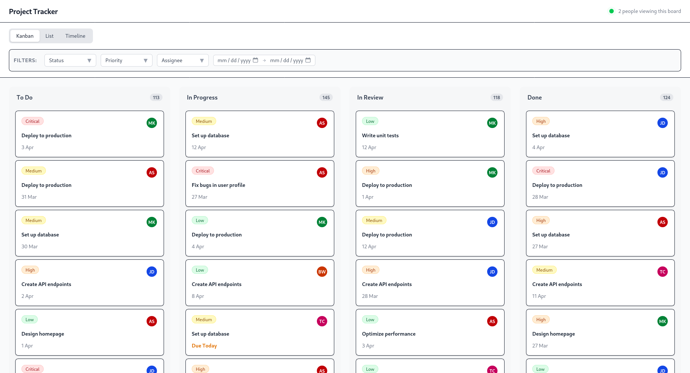
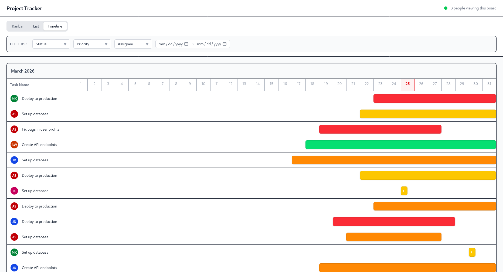
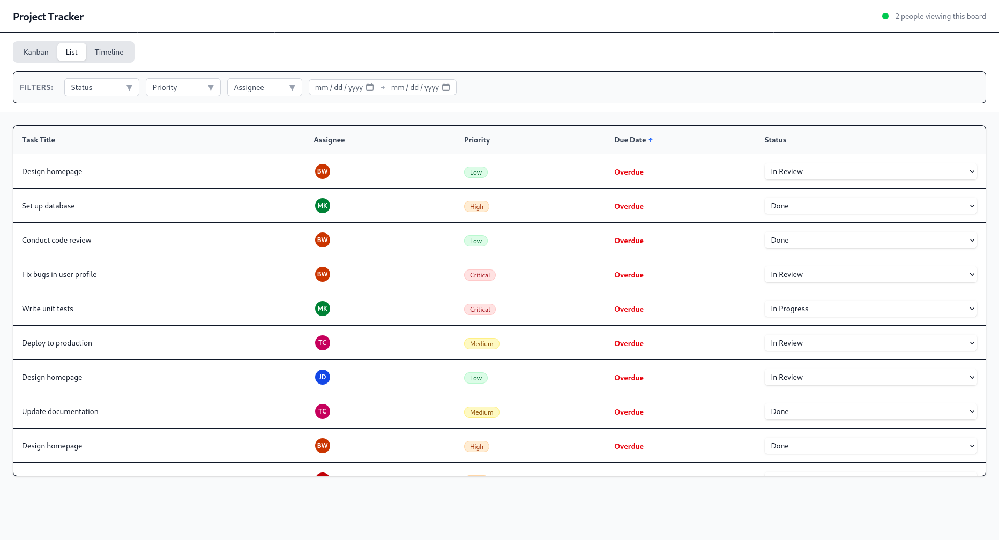
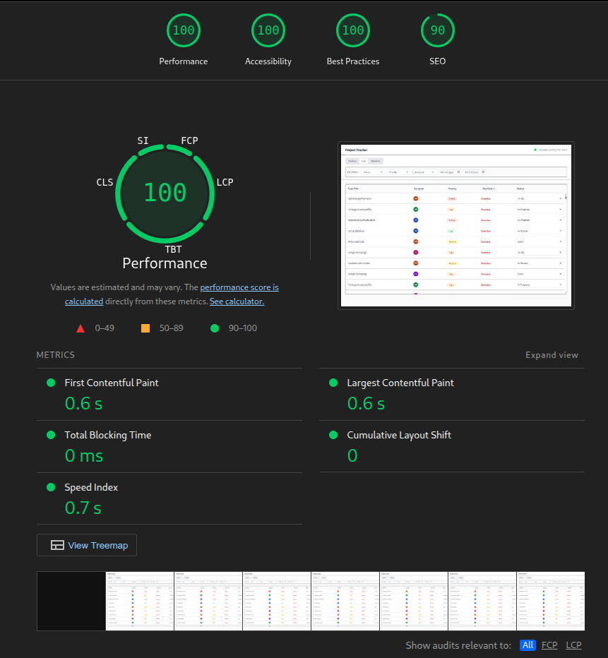

# VGS Project Tracker

[Deployed Link](https://vgs-project-tracker.vercel.app/)





A high-performance frontend application featuring three synchronized views of a single dataset. Built strictly without external UI, drag-and-drop, or virtual scrolling libraries to demonstrate raw DOM manipulation, state architecture, and rendering optimization.

## Setup Instructions

```bash
# Clone the repository and navigate into the directory
git clone https://github.com/Divesh-Kshirsagar/vgs-project-tracker.git
cd vgs-project-tracker

# Install standard dependencies
npm install

# Start the local development server
npm run dev

# To build for production and preview (for Lighthouse testing)
npm run build
npm run preview
```
*Note: The application dynamically generates 500+ tasks on initial load and persists them to `localStorage`.*

## Architectural Decisions

### State Management: Zustand
I chose **Zustand** for state management. For a multi-view application syncing 500+ items, React Context forces unnecessary re-renders unless heavily wrapped in `useMemo`. Zustand provides a flatter, hook-based API that targets specific state slices, allowing synchronous mutations across views without Redux boilerplate. The built-in `persist` middleware instantly saves the mock data to `localStorage`. 

To ensure predictable UI updates during drag-and-drop without complex sorting algorithms, I manipulated the state array directly to append dropped cards to the bottom of their new columns:
```typescript
// Extract task, update status, and push to the end of the array 
// to prevent random vertical jumping in the Kanban column
const newTasks = [...state.tasks];
newTasks.splice(taskIndex, 1);
newTasks.push({ ...state.tasks[taskIndex], status: newStatus });
return { tasks: newTasks };
```

### Virtual Scrolling Implementation
External virtualization libraries were prohibited, so I built a custom `useVirtualizer` hook that calculates visible rows using pure DOM math. A parent "ghost" container uses the total mathematical height of the array to maintain the correct scrollbar size, while absolute CSS positioning pushes the visible rows down into the viewport.
```typescript
// Calculate exact visible range based on scroll position O(1)
const startIndex = Math.max(0, Math.floor(scrollTop / itemHeight) - overscan);
const endIndex = Math.min(
  itemCount - 1,
  Math.floor((scrollTop + containerHeight) / itemHeight) + overscan,
);
```

### Custom Drag-and-Drop Approach
I bypassed standard HTML5 `draggable` events due to their notoriously poor support for touch devices. Instead, I built a custom physics engine using the raw React Pointer Events API. When a card is grabbed, the pointer is captured, updating the CSS `transform` of a floating clone. Valid drop zones are calculated dynamically by temporarily disabling the pointer events on the dragged element to "see" the DOM underneath:
```typescript
// Temporarily hide dragged card so elementFromPoint can detect the column below
const draggedEl = document.getElementById(`drag-${draggedId}`);
if (draggedEl) draggedEl.style.pointerEvents = 'none';

const elementBelow = document.elementFromPoint(e.clientX, e.clientY);
const columnEl = elementBelow?.closest('[data-status]');

if (draggedEl) draggedEl.style.pointerEvents = 'auto';
```

### Lighthouse Performance


## Explanation

The hardest UI problem I solved was building the Kanban board and managing custom drag-and-drop interactions using the raw Pointer Events API. Handling pointer events across different devices without relying on external libraries proved exceptionally challenging. Specifically, ensuring the dragged card tracked the cursor smoothly while accurately communicating with the underlying drop zones required precise DOM coordinate math.

To prevent jarring layout shifts when a card is picked up, I handled the drag placeholder by conditionally rendering a static "ghost" element. When `onPointerDown` fires, the original card is left in the DOM flow as an empty, dashed box with the exact fixed height of the original task. Meanwhile, a floating clone is stripped from the document flow using fixed positioning to follow the cursor. This completely prevents the Kanban column from collapsing.

If I had more time, the one thing I would refactor is the drop placement logic. Currently, I implemented a workaround where dropped tasks are appended to the very end of the target column by extracting them and pushing them to the end of the state array. While this guarantees a safe and predictable drop, it lacks precise sorting between specific cards. In the future, I want to improve this by calculating intersection thresholds to allow true, index-specific insertion within the columns.